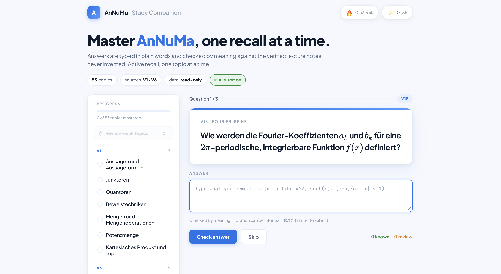

# AnNuMa Study Companion


An AI study agent that quizzes a student on **AnNuMa** (Analysis und
Numerische Mathematik) using **active recall**, drawing every question from
**verified lecture material** — never from the model's own memory. The agent
can read the study material but is structurally prevented from ever modifying
it.

Built for the *Agents for Good* track: improving education.

---

## Why this exists

Two problems make exam prep with a normal chatbot risky:

1. **Hallucination.** For a math exam, one invented formula is harmful. A
   general chatbot has no guarantee its answer matches your course.
2. **Passive review is weak.** Re-reading summaries produces poor retention.
   Learning science is clear that *active recall* — retrieving an answer from
   memory — is far more effective.

The AnNuMa Study Companion solves both: it quizzes you (active recall) using
**only** content retrieved from a verified knowledge base (no hallucination),
and it cannot damage that knowledge base (read-only by construction).

---

## Course concepts demonstrated

The capstone asks for at least three course concepts. This project demonstrates
four, each one load-bearing rather than decorative:

| # | Concept | Where |
| - | ------- | ----- |
| 1 | **MCP Server** | `mcp_server.py` exposes the knowledge base to an agent as two tools: `list_topics` and `query_annuma`. |
| 2 | **Security / guardrail** | `is_read_only()` rejects any query that is not a `SELECT`. The agent can read but never `INSERT`, `UPDATE`, `DELETE`, or `DROP`. |
| 3 | **Agent Skill** | `skills/active-recall/SKILL.md` defines the recall loop and the strict grounding rule (question and judgement use only retrieved material). |
| 4 | **LLM-as-judge** | The web app grades typed answers by mathematical meaning rather than exact string match, returning a verdict, a score, and grounded feedback. |

Concepts 1–3 are the core course requirements; **LLM-as-judge** is a fourth,
going beyond the minimum.

---

## Architecture

```
              ┌─────────────────────────┐
              │   knowledge.db (SQLite)  │   55 sub-topics, V1–V19
              │   built by build_db.py   │   (German study content +
              └────────────┬────────────┘    English Q/A per row)
                           │  every access is SELECT-only
             ┌─────────────┴──────────────┐
             │     is_read_only() guard    │   shared security rule
             └─────────────┬──────────────┘
                 ┌──────────┴───────────┐
                 │                      │
        ┌────────┴────────┐    ┌────────┴─────────┐
        │  mcp_server.py  │    │      app.py      │
        │  (agent layer)  │    │   (web layer)    │
        │                 │    │                  │
        │ list_topics     │    │ Flask + LLM-as-  │
        │ query_annuma    │    │ judge + KaTeX +  │
        │  → any MCP host │    │ streak / XP      │
        └─────────────────┘    └──────────────────┘
```

Both surfaces read the **same** `knowledge.db` through the **same**
`is_read_only()` guardrail, so the security guarantee holds no matter how the
knowledge base is accessed.

---

## Repository layout

```
annuma-study-companion/
├── build_db.py          # builds knowledge.db (55 sub-topics, V1–V19)
├── knowledge.db         # the prebuilt SQLite knowledge base
├── mcp_server.py        # MCP server: list_topics + query_annuma (read-only)
├── app.py               # Flask web app (LLM-as-judge, streak/XP, review mode)
├── templates/
│   └── index.html       # single-page web UI (KaTeX math rendering)
├── skills/
│   └── active-recall/
│       ├── SKILL.md      # the Active Recall agent skill
│       └── scripts/
│           └── format_flashcard.py
└── spec.md              # spec-first design document (Gherkin scenarios)
```

---

## Quick start

### 0. Requirements

- Python 3.10+ (the `mcp` package needs it; 3.12 recommended)
- A terminal

Clone, create a virtual environment, and build the knowledge base:

```bash
git clone https://github.com/AlirezaFakari/annuma-study-companion.git
cd annuma-study-companion

python3 -m venv venv
source venv/bin/activate          # Windows: venv\Scripts\activate

pip install -r requirements.txt   # or: pip install flask google-genai python-dotenv mcp
python build_db.py                # creates knowledge.db (prints 55 topics)
```

---

### A. Run the web app (recommended — easiest to try)

The web app has two modes and **degrades gracefully**, so it works with or
without an API key.

#### Intelligent mode (with a free Gemini API key)

1. Get a free key at <https://aistudio.google.com/apikey>.
2. Create a `.env` file in the project root:

   ```bash
   echo "GEMINI_API_KEY=YOUR_KEY_HERE" > .env
   ```

3. Run:

   ```bash
   python app.py
   ```

4. Open <http://127.0.0.1:5001>.

You'll see **AI tutor: on**. Pick a topic; the tutor writes a question from
the verified material, you type an answer in plain words, and it is judged by
meaning (LLM-as-judge) with a score and grounded feedback. Math is rendered
with KaTeX. Correct answers build a **streak** and **XP**; wrong ones go into
a **"review weak topics"** queue.

#### Static mode (no key needed)

Just skip the `.env` step and run `python app.py`. The badge shows **static
mode**: each topic shows a stored question, and submitting reveals the
reference answer for self-assessment. This guarantees the project is always
runnable, even without a key.

> Note: the free Gemini tier has per-minute limits and can occasionally be
> busy (HTTP 429/503). The app detects this and shows a clear "AI tutor busy"
> message with the reference answer, instead of failing.

---

### B. Run the MCP server (the agent layer)

The MCP server exposes the knowledge base to any MCP-compatible host (e.g. an
agent CLI). Register it in your host's MCP config, pointing at the Python
interpreter inside your virtualenv:

```json
{
  "mcpServers": {
    "annuma-study-companion": {
      "command": "/absolute/path/to/annuma-companion/venv/bin/python",
      "args": ["/absolute/path/to/annuma-companion/mcp_server.py"]
    }
  }
}
```

Then, in the agent, ask it to use the tools — for example:

> *"Using the annuma-study-companion tools, quiz me on Geometrische Reihe.
> Retrieve the material first, then ask me one question and wait for my
> answer."*

The agent will call `query_annuma` (a read-only `SELECT`), ask a question
grounded in the retrieved content, wait, and judge your answer.

---

## The read-only guarantee (how to verify it)

The guardrail is the security core. Any non-`SELECT` query is rejected before
it reaches the database:

```python
def is_read_only(query: str) -> bool:
    return query.strip().upper().startswith("SELECT")
```

You can confirm it: through either surface, a `SELECT` returns rows, while
`DROP TABLE knowledge`, `DELETE ...`, or `UPDATE ...` are refused and the
database is left unchanged.

---

## The knowledge base

`knowledge.db` contains **55 focused sub-topics** spanning the whole course
(lectures **V1–V19**): logic and sets, sequences and series and their
convergence criteria, the exponential function, continuity, differentiation
and integration, complex numbers, machine numbers and error analysis,
interpolation and splines, and function series (Taylor, Fourier, DFT/FFT).

Each row stores the German study content (as in the course) together with a
recall question and answer. Splitting each lecture into focused sub-topics
lets the agent ask precise questions rather than vague ones.

To rebuild or extend it, edit `build_db.py` and re-run `python build_db.py`.

---

## Design notes

- **Self-contained data.** SQLite was chosen over a live notes connection so
  the project is fully reproducible by a reviewer, with no external accounts.
- **Spec-first.** `spec.md` describes the problem, the three concepts, and
  four Given/When/Then scenarios that the implementation follows.
- **Grounding above all.** Every question and judgement is based only on
  retrieved content. If the knowledge base lacks something, the agent says so
  instead of inventing an answer.

---

## License

Provided for the capstone submission. Study content is derived from the
author's own AnNuMa course notes.
